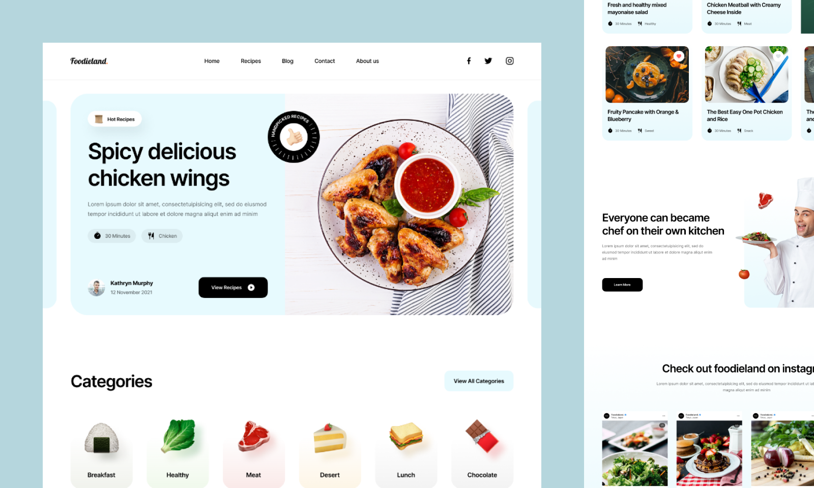

# 🍲 Foodieland

Эстетичный, быстрый и отзывчивый многостраничный сайт (MPA) с рецептами для тех, кто любит готовить дома. Проект разработан как демонстрация зрелой инженерной культуры во фронтенде: с упором на доступность интерфейса (a11y), чистую семантику для поисковых роботов (SEO basics) и строгую автоматизацию процессов разработки.

## 🛠 Мой Стек и Инструменты

### 🏗 Архитектура и Сборка
* **JSX (Minista)** — компонентный подход для многостраничного сайта, генерирующий на выходе чистый статический HTML. Идеально для SEO-продвижения контентного кулинарного блога.
* **Vite** — моментальный запуск и сборка проекта.
* **PostCSS (`postcss-preset-env`, `postcss-pxtorem`)** — автоматический перевод пикселей в `rem` для масштабируемости под нужды пользователей и автопрефиксы для поддержки старых браузеров.

### 🎨 Стили, Адаптив и Архитектура
* **CSS3:** Flexbox & Grid Layouts для красивых, ровных сеток с карточками блюд и ингредиентами.
* **Adaptive & Responsive:** Адаптивная верстка (комбинация стратегий Mobile/Desktop-First и Media Queries). Сайт идеально выглядит как на смартфоне у плиты, так и на большом мониторе.
* **Sass (SCSS) + БЭМ** — модульная структура стилей, где каждый компонент (таймер, список ингредиентов, карточка рецепта) изолирован и легко поддерживается.

### 🧠 Логика (JavaScript)
* **JavaScript (ES6+):** Написан в объектно-ориентированном стиле (**OOP**).
* **Модульность, DOM API и замыкания** — чистая логика для интерактивных элементов без использования тяжелых и лишних фреймворков.

### 🤖 Автоматизация и Качество кода (CI/CD Basics)
* **Линтеры и форматирование:** ESLint, Stylelint, Prettier.
* **Проверка перед коммитом:** Автоматические Git-хуки через **Husky + Lint-staged** (код проверяется на ошибки до того, как попадет в репозиторий).
* **История изменений:** Commitlint (строгий контроль семантики коммитов).
* **Процесс разработки:** GitHub Flow.

### 📐 Дизайн, UX и Доступность (a11y)
* **UI/UX basics:** Детальная проработка всех состояний элементов (`hover`, `active`, `focus`) для кнопок шагов приготовления и фильтров кухонь.
* **Figma:** Разработка строго по макету (Pixel-Perfect).
* **Забота о пользователе:** Крупные зоны клика (минимум 48x48px) для интерактивных элементов, чтобы по ним было удобно тапать на мобильном телефоне прямо во время готовки.